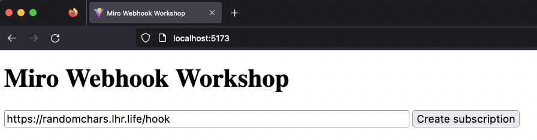

# Miro Webhook Workshop

A workshop to build and test a Miro webhook.

## Prerequisites
- a Miro account with a Developer team
- an installed application and its access token
- an existing board

See more details [here](https://developers.miro.com/reference/api-reference).

Create or edit the `.env.local` file (git ignored) to set the `VITE_MIRO_ACCESS_TOKEN` variable with your Miro access token:
```
VITE_MIRO_ACCESS_TOKEN=<access-token>
```

## Run

Start the local dev server with `npm run dev`, and open the test page at http://localhost:5173.

In order to test the hook locally, the dev server must be reachable from the internet, with a valid HTTPS certificate.
One way to do this is to tunnel the dev server through services such as [ngrok](https://ngrok.com/) or [localhost.run](https://localhost.run/) ([this page](https://github.com/anderspitman/awesome-tunneling) has a good list).<br>
Example with localhost.run:
```
ssh -R 80:localhost:5173 localhost.run
```
This should expose your dev server through a public URL like `https://randomchars.lhr.life`.

From the test page, you can create webhook subscriptions by entering the public URL of the `/hook` endpoint of the dev server:



## Hook function

The actual `hook` TypeScript function is implemented in [src/hook.ts](src/hook.ts), it handles the [webhooks event flow](https://developers.miro.com/reference/webhooks-overview#webhooks-event-workflow) and can be completed by your own webhook logic.
